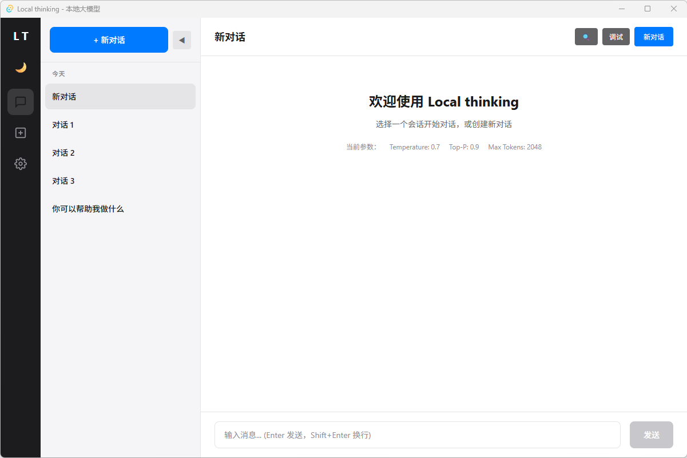
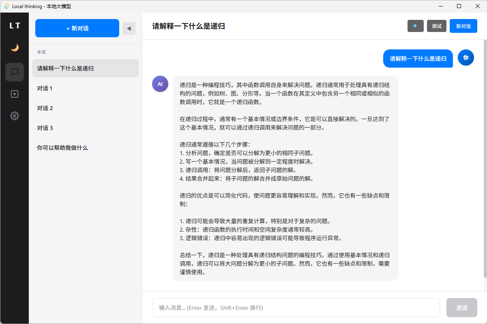
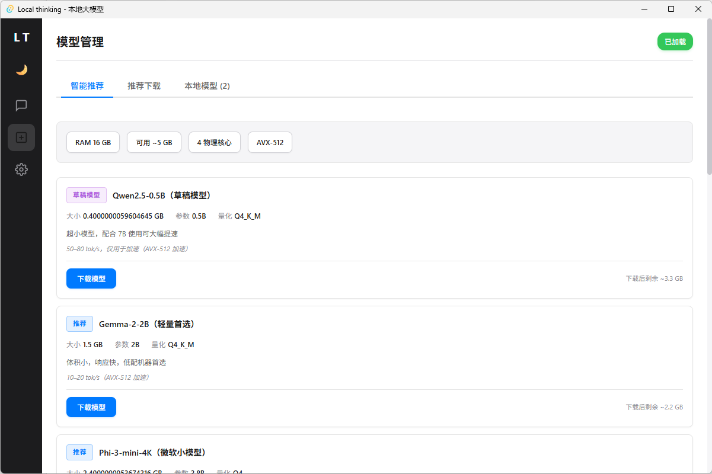
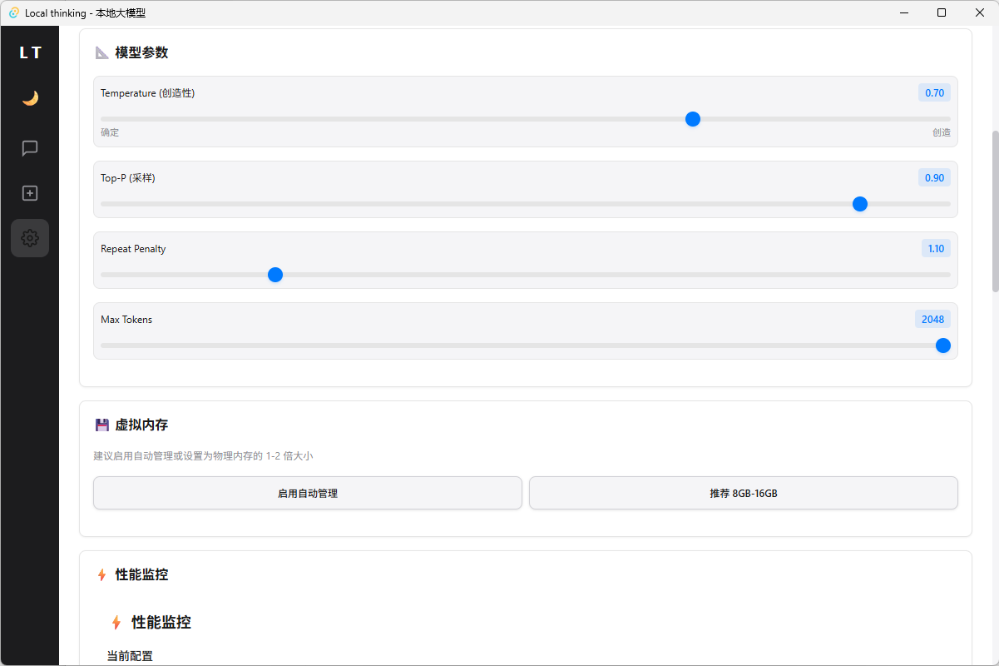

# Local-thinking - 本地AI聊天应用

<div align="center">


**一个基于 Tauri 2.0 + llama.cpp 的本地AI聊天应用**

[特性](#-核心特性) • [快速开始](#-快速开始) • [使用指南](#-使用指南) • [演示](#-功能演示) • [开发](#-开发)

</div>

---

## 📸 应用截图

### 主界面
<!--
添加主界面截图
建议尺寸：1200x800
格式：PNG或JPG
-->


### 对话界面
<!--
添加对话界面截图，展示思考块功能
-->


### 模型管理
<!--
添加模型管理界面截图
-->


### 设置页面
<!--
添加设置页面截图
-->


---

## 🚀 核心特性

### 💬 智能对话
- **实时流式输出** - 像ChatGPT一样流畅的打字效果
- **思考块显示** - 独特的 `<思考>` 和 `<回答>` 分离显示
- **多会话管理** - 支持创建多个对话，自动保存历史
- **会话分组** - 按时间线自动分组（今天、昨天、七天内等）
- **搜索功能** - 快速查找历史对话
- **上下文记忆** - 完整保留对话上下文

### 🤖 模型管理
- **智能推荐** - 根据硬件配置自动推荐最适合的模型
- **一键下载** - 支持从Hugging Face直接下载GGUF格式模型
- **进度显示** - 实时显示下载进度和速度
- **自动校验** - 下载完成后自动验证文件完整性
- **模型切换** - 轻松在不同模型间切换

### ⚙️ 高级设置
- **参数调节**
  - Temperature（创造性）：0.0 - 2.0
  - Top-P（采样）：0.0 - 1.0
  - Repeat Penalty（重复惩罚）：1.0 - 2.0
  - Max Tokens（最大长度）：128 - 8192
  - Context Size（上下文大小）：512 - 8192

- **系统提示词**
  - 内置多种专业角色预设
  - 支持自定义系统提示词
  - 分类清晰：通用、技术、数据、创作、商业等

- **性能优化**
  - 线程数调节（1-8核）
  - 虚拟内存管理
  - GPU加速支持（如可用）
  - 实时性能监控

### 🌐 API服务
- **OpenAI兼容接口** - 支持标准的 `/v1/chat/completions` API
- **本地端口配置** - 可自定义API端口
- **一键启用/禁用** - 灵活的API开关

### 🎨 用户体验
- **现代化UI** - 简洁美观的界面设计
- **暗色主题** - 护眼的暗色模式
- **响应式布局** - 适配不同屏幕尺寸
- **代码高亮** - 支持多种编程语言的语法高亮
- **虚拟滚动** - 流畅处理长对话历史

---

## 🎯 快速开始

### 系统要求

- **操作系统**: Windows 10+, macOS 11+, 或主流Linux发行版
- **内存**: 至少8GB RAM（推荐16GB+）
- **存储**: 至少10GB可用空间（用于存储模型文件）
- **CPU**: 支持AVX2指令集（推荐）

### 下载安装

#### 方式1：下载预编译版本（推荐）

1. 访问 [Releases](https://github.com/faqiangwang/Localthinking/releases) 页面
2. 下载适合你操作系统的安装包：
   - **Windows**: `.msi` 或 `.exe` 安装包
   - **macOS**: `.dmg` 镜像文件
   - **Linux**: `.AppImage` 或 `.deb` 包
3. 运行安装程序并完成安装

#### 方式2：从源码构建

```bash
# 1. 克隆仓库
git clone https://github.com/faqiangwang/Localthinking.git
cd Local-mind

# 2. 安装依赖
npm install

# 3. 运行应用
npm run tauri dev
```

### 首次使用

1. **启动应用** - 双击桌面图标或从命令行启动
2. **下载模型** - 进入"模型管理"，选择推荐的模型进行下载
3. **开始对话** - 下载完成后，在主界面输入问题开始对话

---

## 📖 使用指南

### 1. 下载和管理模型

#### 智能推荐
应用会根据你的硬件配置自动推荐最适合的模型：

- **Best Tier** - 最佳性能和质量的平衡
- **Good Tier** - 性能较好的选择
- **Marginal Tier** - 可以运行，但可能较慢
- **Too Large** - 超出硬件能力，不推荐

#### 手动下载
1. 点击左侧边栏的"模型管理"
2. 点击"添加自定义模型"
3. 输入模型名称和Hugging Face下载链接
4. 点击下载，等待完成

#### 支持的模型格式
- GGUF格式（推荐）
- Qwen系列
- Gemma系列
- DeepSeek系列
- 其他兼容llama.cpp的模型

### 2. 开始对话

#### 创建新会话
- 点击左侧边栏的"新建对话"按钮
- 或使用快捷键 `Ctrl+N` (Windows/Linux) / `Cmd+N` (macOS)

#### 发送消息
- 在底部输入框输入问题
- 按 `Enter` 发送
- 按 `Shift+Enter` 换行

#### 思考块功能
模型回复时会分为两部分：
- **思考块**（灰色背景）- 显示模型的思考过程
  - 可折叠/展开
  - 点击标签切换显示状态
- **回答块**（白色背景）- 显示最终答案

#### 管理会话
- **切换会话** - 点击左侧会话列表
- **重命名** - 双击会话名称进行编辑
- **删除会话** - 点击会话旁的 × 按钮
- **搜索会话** - 使用顶部搜索框

### 3. 调整参数

在"设置"页面可以调整以下参数：

#### Temperature（创造性）
- **范围**: 0.0 - 2.0
- **效果**:
  - 低值（0.0-0.3）: 输出更确定、一致
  - 中值（0.4-0.7）: 平衡创造性和准确性（推荐）
  - 高值（0.8-2.0）: 更有创造性，但可能不稳定

#### Top-P（采样）
- **范围**: 0.0 - 1.0
- **效果**: 控制词汇选择的多样性
- **推荐**: 0.9

#### Repeat Penalty（重复惩罚）
- **范围**: 1.0 - 2.0
- **效果**: 减少重复内容
- **推荐**: 1.1

#### Max Tokens（最大长度）
- **范围**: 128 - 8192
- **效果**: 限制单次回复的最大长度
- **推荐**: 2048

### 4. 自定义系统提示词

#### 使用预设角色
在"设置"→"系统提示词"中，选择预设角色：

**通用助手**
- 全能助手
- 中文助手
- 英语学习

**技术开发**
- 全栈开发
- 算法专家
- 数据库专家
- DevOps

**数据科学**
- 数据科学家
- 商业分析

**内容创作**
- 写作教练
- 创意写作
- 内容营销

**商业咨询**
- 商业顾问
- 产品经理
- 项目管理

**专业服务**
- 翻译专家
- UI/UX设计
- 心理咨询

**教育辅导**
- 私人教师
- 学术写作

#### 自定义提示词
在文本框中输入自定义的系统提示词，例如：

```
你是一个专业的Python程序员，擅长：
- Web开发（Django、Flask、FastAPI）
- 数据分析（Pandas、NumPy）
- 机器学习（Scikit-learn、TensorFlow）

回答时请提供代码示例和详细注释。
```

### 5. 使用API服务

#### 启用API
1. 进入"设置"→"API服务"
2. 开启"启用API"开关
3. 记录显示的端点地址

#### 调用示例

```bash
curl http://127.0.0.1:8080/v1/chat/completions \
  -H "Content-Type: application/json" \
  -d '{
    "messages": [
      {"role": "user", "content": "你好"}
    ],
    "stream": true
  }'
```

#### Python示例

```python
import requests

response = requests.post(
    "http://127.0.0.1:8080/v1/chat/completions",
    json={
        "messages": [
            {"role": "user", "content": "解释一下量子计算"}
        ],
        "stream": True
    },
    stream=True
)

for line in response.iter_lines():
    if line:
        print(line.decode('utf-8'))
```

---

## 🎬 功能演示

### 演示1：智能对话

<details>
<summary>点击展开示例</summary>

#### 用户提问：
```
请解释一下什么是递归，并给出一个例子
```

#### 模型回复：

**思考过程**：
```
<思考>
用户想了解递归的概念。我需要：
1. 用简单易懂的语言解释递归
2. 提供一个具体的编程例子
3. 说明递归的优缺点

递归的核心是函数自己调用自己。可以用斐波那契数列作为例子。
</思考>
```

**最终答案**：
```
递归是一种编程技巧，函数直接或间接调用自身。

**特点：**
- 将大问题分解为相似的小问题
- 必须有终止条件（基准情况）
- 每次调用都应该使问题规模减小

**示例：斐波那契数列**

```python
def fibonacci(n):
    # 基准情况
    if n <= 1:
        return n
    # 递归调用
    return fibonacci(n-1) + fibonacci(n-2)

# 计算
print(fibonacci(10))  # 输出: 55
```

**优点：** 代码简洁、逻辑清晰
**缺点：** 可能导致栈溢出，效率不如循环
```

</details>

### 演示2：代码生成

<details>
<summary>点击展开示例</summary>

#### 用户提问：
```
用Python写一个快速的文件搜索工具
```

#### 模型回复：

**思考过程**：
```
<思考>
用户需要一个文件搜索工具。我应该：
1. 使用pathlib进行路径操作
2. 实现递归搜索
3. 支持文件名模式匹配
4. 添加进度显示
5. 处理异常情况

使用glob模块进行模式匹配会很高效。
</思考>
```

**最终答案**：
```python
from pathlib import Path
import time
from typing import List

def find_files(directory: str, pattern: str) -> List[str]:
    """
    在指定目录中搜索匹配模式的文件

    Args:
        directory: 搜索目录
        pattern: 文件名模式（如 *.txt）

    Returns:
        匹配的文件路径列表
    """
    path = Path(directory)
    if not path.exists():
        raise ValueError(f"目录不存在: {directory}")

    matches = list(path.rglob(pattern))
    return [str(f) for f in matches if f.is_file()]

# 使用示例
if __name__ == "__main__":
    start_time = time.time()

    # 搜索所有Python文件
    results = find_files(".", "*.py")

    for file in results[:10]:  # 显示前10个
        print(f"找到: {file}")

    print(f"\n总计找到 {len(results)} 个文件")
    print(f"耗时: {time.time() - start_time:.2f}秒")
```

**运行结果：**
```
找到: ./src/main.py
找到: ./src/utils.py
找到: ./tests/test_main.py

总计找到 15 个文件
耗时: 0.03秒
```

</details>

### 演示3：多轮对话

<details>
<summary>点击展开示例</summary>

#### 第1轮：
```
用户：什么是机器学习？
模型：机器学习是人工智能的一个分支...
```

#### 第2轮：
```
用户：能给我举一个具体例子吗？
模型：当然！一个经典的例子是邮件 spam 过滤...
```

#### 第3轮：
```
用户：那深度学习和机器学习有什么区别？
模型：很好的问题！深度学习是机器学习的一个子集...
```

**说明：** 应用会保留完整对话历史，模型可以理解上下文关联。

</details>

---

## 🏗️ 技术架构

### 技术栈

**前端**
- React 18 - UI框架
- TypeScript - 类型安全
- Vite - 构建工具
- CSS Modules - 样式隔离

**后端**
- Rust - 系统编程
- Tauri 2.0 - 桌面应用框架
- llama.cpp - LLM推理引擎

**其他**
- GitHub Actions - CI/CD
- Cross-rs - 跨平台编译

### 项目结构

```
Local-mind/
├── src/                    # React前端代码
│   ├── components/         # UI组件
│   │   ├── Chat/          # 聊天界面
│   │   ├── ModelManager/  # 模型管理
│   │   └── Settings/      # 设置页面
│   ├── hooks/             # React Hooks
│   ├── store/             # 状态管理
│   ├── types/             # TypeScript类型
│   └── utils/             # 工具函数
├── src-tauri/             # Rust后端代码
│   ├── src/
│   │   ├── chat.rs        # 聊天逻辑
│   │   ├── models.rs      # 模型管理
│   │   ├── commands.rs    # Tauri命令
│   │   └── engine.rs      # llama.cpp绑定
│   └── Cargo.toml         # Rust依赖
└── .github/               # GitHub Actions
    └── workflows/         # CI/CD配置
```

### 性能优化

- **虚拟滚动** - 高效处理大量消息
- **防抖保存** - 减少localStorage写入频率
- **流式输出** - 实时显示AI回复
- **异步处理** - 不阻塞UI线程
- **缓存机制** - 模型下载断点续传

---

## 🗺️ 开发路线图

### v0.2.0 (计划中)
- [ ] 支持更多模型格式
- [ ] 添加语音输入功能
- [ ] 导出对话为Markdown
- [ ] 自定义主题

### v0.3.0 (计划中)
- [ ] 多语言界面支持
- [ ] 插件系统
- [ ] 知识库功能
- [ ] 模型微调界面

### v1.0.0 (未来)
- [ ] 完整的文档
- [ ] 单元测试覆盖
- [ ] 性能基准测试
- [ ] 稳定的API

---

## 🤝 贡献指南

欢迎贡献代码、报告问题或提出建议！

### 如何贡献

1. Fork本仓库
2. 创建特性分支 (`git checkout -b feature/AmazingFeature`)
3. 提交更改 (`git commit -m 'Add some AmazingFeature'`)
4. 推送到分支 (`git push origin feature/AmazingFeature`)
5. 开启Pull Request

### 开发规范

- 遵循现有代码风格
- 添加必要的注释
- 更新相关文档
- 确保代码通过编译

---

## ❓ 常见问题

### Q1: 支持哪些模型？
**A:** 支持所有GGUF格式的模型，包括Qwen、Gemma、DeepSeek等。

### Q2: 最小硬件要求是什么？
**A:**
- 8GB RAM（可运行1.5B-3B模型）
- 16GB RAM（推荐，可运行7B模型）
- 支持AVX2指令集的CPU

### Q3: 可以离线使用吗？
**A:** 完全可以！下载模型后，无需联网即可使用。

### Q4: 如何提高推理速度？
**A:**
1. 增加线程数（在设置中调整）
2. 使用更小的模型
3. 减少上下文大小
4. 使用量化程度更高的模型

### Q5: 商业使用需要授权吗？
**A:** 是的，商业使用需要获得商业授权。请联系：faqiangwang@163.com

### Q6: 如何备份我的对话？
**A:** 对话数据存储在浏览器的localStorage中。建议定期导出：
1. 打开开发者工具（F12）
2. 进入Application → Local Storage
3. 复制相关数据

---

## 📄 许可证

本项目采用 **GPL-3.0 许可证** 开源。

### 使用权限

- ✅ **个人使用**：完全免费，可自由使用、修改和分发
- ✅ **学习研究**：可用于学习、研究和个人项目
- ✅ **开源项目**：可在遵循 GPL-3.0 的开源项目中使用

### 商业使用

- 🏢 **商业授权**：企业或商业用途需要获得商业授权

如需商业授权，请联系：
- 📧 邮箱：faqiangwang@163.com
- 💬 GitHub：[@faqiangwang](https://github.com/faqiangwang)

---

## 🔗 相关链接

- [Tauri 文档](https://tauri.app/)
- [llama.cpp](https://github.com/ggerganov/llama.cpp)
- [GGUF 模型库](https://huggingface.co/models?search=gguf)
- [React 文档](https://react.dev/)

---

## ⭐ Star History

如果这个项目对你有帮助，请给它一个Star！

[](https://star-history.com/#faqiangwang/Localthinking&Date)

---

## 📮 联系方式

- 📧 **邮箱**: faqiangwang@163.com
- 💬 **GitHub Issues**: [提交问题](https://github.com/faqiangwang/Localthinking/issues)
- 📝 **讨论区**: [GitHub Discussions](https://github.com/faqiangwang/Localthinking/discussions)

---

<div align="center">

**Made with ❤️ by faqiangwang**

[⬆ 返回顶部](#local-thinking---本地ai聊天应用)

</div>
